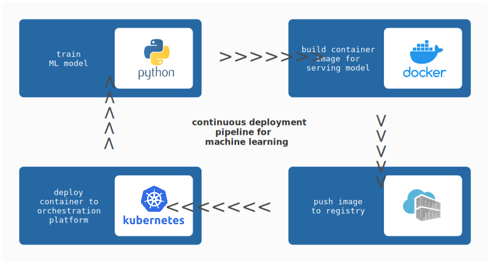
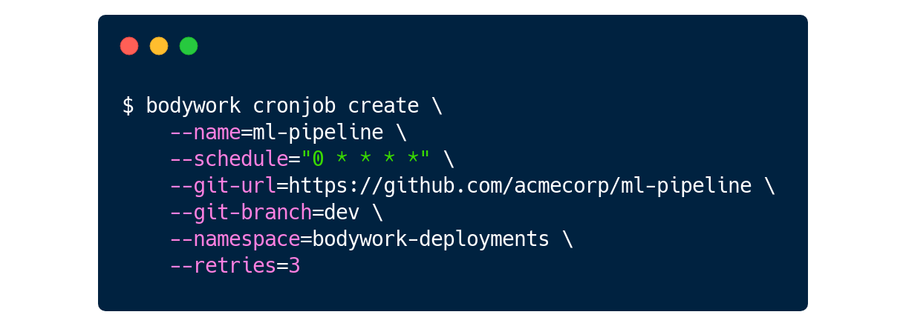
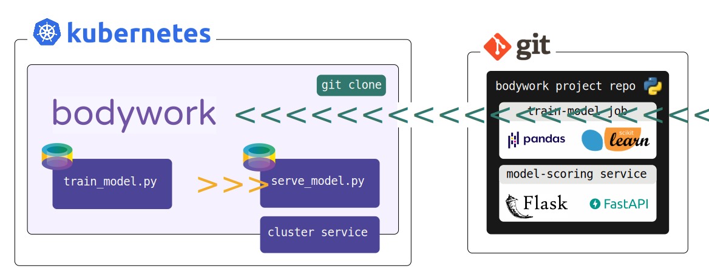
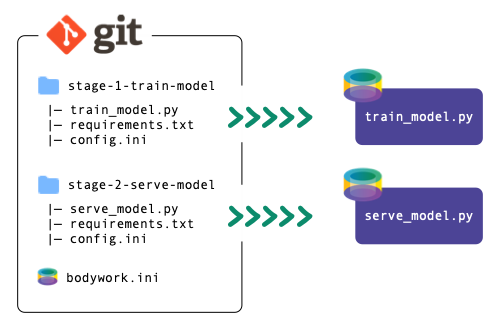
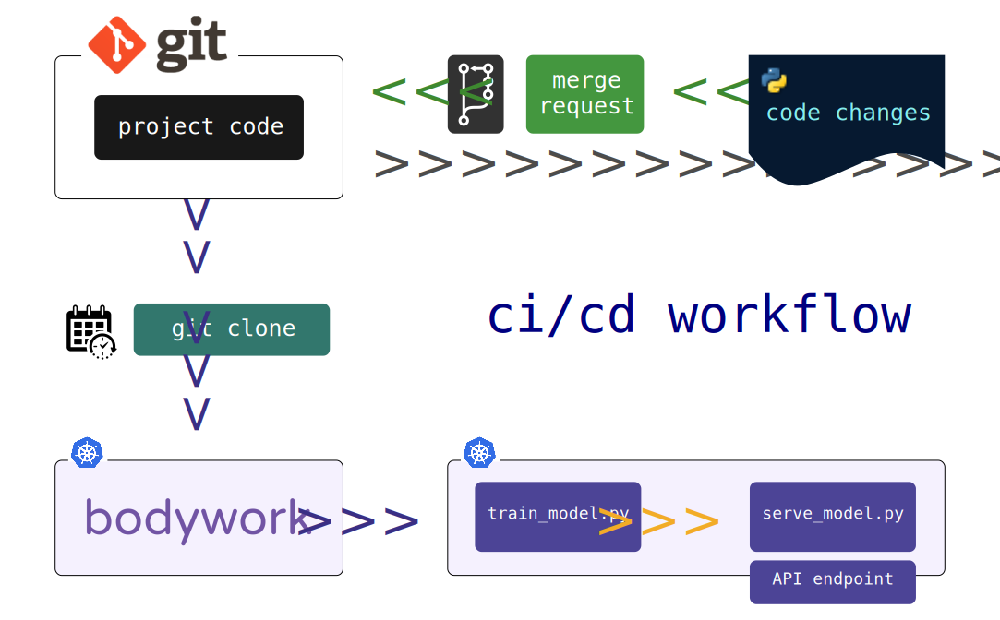

# Overview

Bodywork deploys machine learning projects developed in Python, to [Kubernetes](https://en.wikipedia.org/wiki/Kubernetes). It helps you:

* [x] serve models as microservices
* [x] execute batch jobs
* [x] run reproducible pipelines

On demand, or on a schedule. It automates repetitive DevOps tasks and frees machine learning engineers to focus on what they do best - solving data problems with machine learning.

## Where does Bodywork Fit?

Bodywork is aimed at teams who want to deploy machine learning projects in containers. It will deliver your project's Python modules directly from your Git repository into Docker containers and manage their deployment to a Kubernetes cluster.

### What is it Replacing?

The process of building container images and deploying them to an orchestration platform is a complex engineering task. The diagram below shows the steps required to deploy a model-scoring service, together with the tools you could use to achieve this.

Developing and maintaining these deployment pipelines is time-consuming. If there are multiple projects, each requiring re-training and re-deployment, then without the type of automation that Bodywork provides, management of these pipelines will quickly become a large burden.

## Where do I Install Bodywork?

Bodywork is distributed as a Python package that exposes a command line interface for configuring Kubernetes to run Bodywork deployments. It takes just one command to schedule a pipeline hosted on GitHub to run every evening,

## What does Bodywork Do?

When Kubernetes triggers a Bodywork deployment, it runs pre-built [Bodywork containers](https://hub.docker.com/repository/docker/bodyworkml/bodywork-core) that clone your project's Git repository and run the Python modules within it. At no point is there any need to build Docker images, push them to a container registry or trigger a deployment.

This process is shown below for a `train-and-serve` pipeline with two stages: train model (as a batch job), then serve the trained model (as a microservice with a REST API).

## What will I need to Do?

Divide your project into discrete stages, creating a new directory for each one. Every stage will need an executable Python module for Bodywork to run, a requirements file for installing external Python dependencies, and a simple config file. Bundle these files together with a workflow execution plan, into a Git repository and you're ready to go.

You do **not** need to tie yourself to new APIs - package your existing codebase into this framework and watch as Bodywork pulls each stage into its own container and deploys to Kubernetes.

## CI/CD for Machine Learning

Because Bodywork can run deployments on a schedule, every time cloning the latest version of your codebase in the target branch, this system naturally forms an end-to-end CI/CD platform for your machine learning project, as illustrated below.

This is the [GitOps](https://www.gitops.tech) pattern for cloud native continuous delivery.

## Key Features

`Continuous Deployment`
: Batch jobs, model-scoring services as well as complex ML pipelines, using pre-built [Bodywork containers](https://hub.docker.com/repository/docker/bodyworkml/bodywork-core) to orchestrate end-to-end machine learning workflows.

`Resilience`
: Bodywork handles automatic retires for batch jobs and automatic roll-backs for service deployments, without any downtime.

`Horizontal Scaling`
: Bodywork can back your service endpoints with as many container replicas as you need to handle your API traffic volumes.

`No APIs to Learn`
: Bodywork does not require you to re-write your machine learning projects to conform to our view of how your codebase should be engineered. All you need to do is provide executable Python modules for starting service applications and running batch jobs.

`Multi-Cloud`
: Bodywork deploys to Kubernetes clusters, which are available as managed services from all major cloud providers. Kubernetes is indifferent to where it is running, so changing cloud provider is as easy as pointing to a different cluster.

`Written in Python`
: The native language of machine learning and data science, so your team can have full visibility of what Bodywork is doing and how.

`Open Source`
: Bodywork is built and maintained by machine learning engineers, for machine learning engineers, who are committed to keeping it 100% open-source.

Bodywork brings DevOps to your machine learning projects and will form the basis of your [Machine Learning Operations (MLOps)](https://en.wikipedia.org/wiki/MLOps) platform. It will ensure that your projects are always trained with the latest data, the most recent models are always deployed and your machine learning systems remain highly-available.

## We want your Feedback

If Bodywork sounds like a useful tool, then please give a **GitHub Star ★** to [bodywork-core](https://github.com/bodywork-ml/bodywork-core).

## Before you get Startred

Before you start exploring what Bodywork can do for you, you will need:

`Access to a Kubernetes Cluster` 
: Either locally using [minikube](https://minikube.sigs.k8s.io/docs/) or [Docker-for-desktop](https://www.docker.com/products/docker-desktop), or as a managed service from a cloud provider, such as [EKS on AWS](https://aws.amazon.com/eks) or [AKS on Azure](https://azure.microsoft.com/en-us/services/kubernetes-service/).

`A GitHub Account`
: Currently, we only support public and private repositories hosted on [GitHub](https://github.com). Support for GitLab, BitBucket and Azure DevOps will come later in 2021.

Familiarity with basic [Kubernetes concepts](https://kubernetes.io/docs/concepts/) and some exposure to the [kubectl](https://kubernetes.io/docs/reference/kubectl/overview/) command-line tool will make life easier. We recommend the first two introductory sections of Marko Lukša's excellent book [Kubernetes in Action](https://www.manning.com/books/kubernetes-in-action?query=kubernetes), or the introductory article we wrote on [Deploying Python ML Models with Flask, Docker and Kubernetes](https://alexioannides.com/2019/01/10/deploying-python-ml-models-with-flask-docker-and-kubernetes/).

If you need help with any of this, then please don't hesitate to [contact us](contact.md) and we'll do our best to get you up-and-running.
