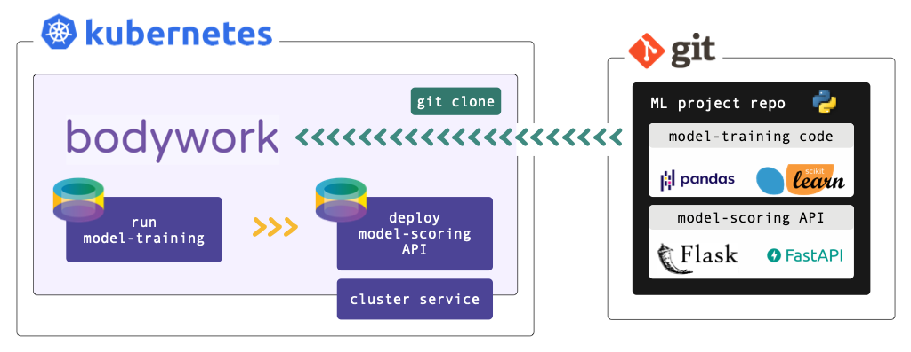

#

Bodywork is a minimal Python framework that helps machine learning engineers run batch jobs, serve models and deploy machine learning pipelines, in containers on [Kubernetes](https://en.wikipedia.org/wiki/Kubernetes).

It is built by machine learning engineers, to automate the repetitive and time-consuming tasks that most machine learning engineers think of as [DevOps](https://en.wikipedia.org/wiki/DevOps), freeing them to focus on what they do best - solving data problems with machine learning.

## What Problems Does Bodywork Solve?

Running machine learning code in containers has become a common pattern to guarantee reproducibility between what has been developed and what is deployed in production environments.

Most machine learning engineers do not, however, have the time (and often the desire) to develop the skills and expertise required to deliver and deploy containerised machine learning systems into production environments. This requires an understanding of how to build container images, how to push build artefacts to image repositories and how to configure a container orchestration platform to use these to execute batch jobs and deploy services.

Maintaining these deployment pipelines is also time-consuming - both day-to-day and as projects evolve in complexity. If there are multiple projects to worry about, all requiring systematic re-training and re-deployment, then it is easy to see how quickly the management of these pipelines will become a large and undesirable burden.

This is where the Bodywork framework steps-in - to take responsibility for pulling you machine learning projects into containers and deploying them to the Kubernetes container orchestration platform. Bodywork can ensure that your projects are always trained with the latest data, the most recent models are always deployed and your machine learning systems remain generally available.

More specifically, Bodywork helps machine learning engineers to:

- **continuously deliver** - code for preparing features, training models, scoring data and defining model-scoring services. Bodywork containers running on Kubernetes will pull code directly from your project's Git repository, removing the need to build-and-push your own container images.
- **continuously deploy** - batch jobs, model-scoring services and complex machine learning pipelines, using the Bodywork workflow-controller to orchestrate end-to-end machine learning workflows on Kubernetes.

Bodywork uses Kubernetes for running machine learning jobs and services, because we believe that Kubernetes comes shipped with all the resources required for building an effective Machine Learning Operations ([MLOps](https://en.wikipedia.org/wiki/MLOps)) platform.

## Prerequisites

Before you start exploring what Bodywork can do for you, you will need:

- access to a Kubernetes cluster - either locally using [minikube](https://minikube.sigs.k8s.io/docs/) or [Docker-for-desktop](https://www.docker.com/products/docker-desktop), or as a managed service from a cloud provider, such as [EKS on AWS](https://aws.amazon.com/eks) or [AKS on Azure](https://azure.microsoft.com/en-us/services/kubernetes-service/).
- a [GitHub](https://github.com) account.

Familiarity with basic [Kubernetes concepts](https://kubernetes.io/docs/concepts/) and some exposure to the [kubectl](https://kubernetes.io/docs/reference/kubectl/overview/) command-line tool will make life easier. We recommend the first two introductory sections of Marko Lukša's excellent book [Kubernetes in Action](https://www.manning.com/books/kubernetes-in-action?query=kubernetes), or the introductory article we wrote on [Deploying Python ML Models with Flask, Docker and Kubernetes](https://alexioannides.com/2019/01/10/deploying-python-ml-models-with-flask-docker-and-kubernetes/).
