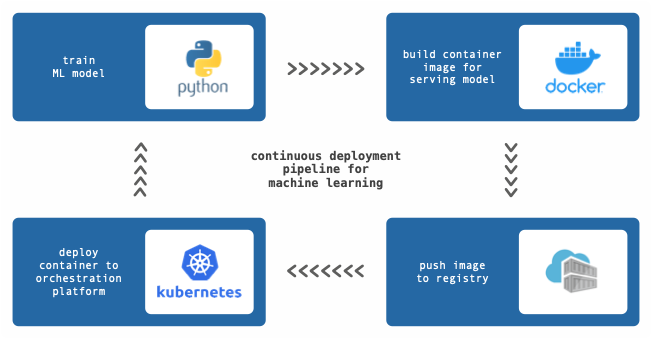

Bodywork is a deployment automation framework for machine learning in Python. It helps you schedule batch jobs, serve models and deploy ML pipelines, in containers on [Kubernetes](https://en.wikipedia.org/wiki/Kubernetes).

It automates repetitive and time-consuming tasks that machine learning engineers think of as [DevOps](https://en.wikipedia.org/wiki/DevOps), freeing them to focus on what they do best - solving data problems with machine learning.

## What Problems Does Bodywork Solve?

Running machine learning code in containers has become a common pattern to guarantee reproducibility between what has been developed and what is deployed to production.

The process of building container images and deploying them to an orchestration platform is a complex engineering task. The diagram below shows the steps required to deploy a model-scoring service, together with the tools you could use to achieve this.

Developing and maintaining these deployment pipelines is time-consuming. They will break and they will need to be repaired. If there are multiple projects, each requiring re-training and re-deployment, then the management of these pipelines will quickly become a large burden.

This is where Bodywork steps-in - to take responsibility for pulling you machine learning projects into containers and deploying them to the Kubernetes container orchestration platform.

Bodywork can ensure that your projects are always trained with the latest data, the most recent models are always deployed and your machine learning systems remain highly available.

More specifically, Bodywork helps machine learning engineers to:

- **continuously deliver** - code for preparing features, training models, scoring data and defining model-scoring services. Bodywork containers running on Kubernetes will pull code directly from your project's Git repository, removing the need to build-and-push your own container images.
- **continuously deploy** - batch jobs, model-scoring services and complex ML pipelines, using the Bodywork workflow-controller to orchestrate end-to-end machine learning workflows on Kubernetes.

Bodywork handles automatic retires for batch jobs and for service deployments it will manage roll-backs and horizontal-scaling (via replication). It makes the deployment of highly-available and resilient machine learning systems, easy.

Bodywork uses Kubernetes for running machine learning jobs and services, because we believe that Kubernetes comes shipped with all the resources required for building an effective Machine Learning Operations ([MLOps](https://en.wikipedia.org/wiki/MLOps)) platform.

Bodywork is built and maintained by machine learning engineers, for machine learning engineers, and will always remain 100% open-source.

## Prerequisites

Before you start exploring what Bodywork can do for you, you will need:

- access to a Kubernetes cluster - either locally using [minikube](https://minikube.sigs.k8s.io/docs/) or [Docker-for-desktop](https://www.docker.com/products/docker-desktop), or as a managed service from a cloud provider, such as [EKS on AWS](https://aws.amazon.com/eks) or [AKS on Azure](https://azure.microsoft.com/en-us/services/kubernetes-service/).
- a [GitHub](https://github.com) account.

Familiarity with basic [Kubernetes concepts](https://kubernetes.io/docs/concepts/) and some exposure to the [kubectl](https://kubernetes.io/docs/reference/kubectl/overview/) command-line tool will make life easier. We recommend the first two introductory sections of Marko Lukša's excellent book [Kubernetes in Action](https://www.manning.com/books/kubernetes-in-action?query=kubernetes), or the introductory article we wrote on [Deploying Python ML Models with Flask, Docker and Kubernetes](https://alexioannides.com/2019/01/10/deploying-python-ml-models-with-flask-docker-and-kubernetes/).
