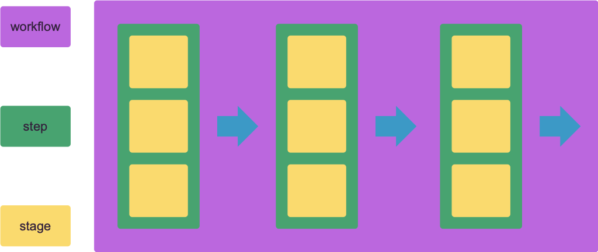
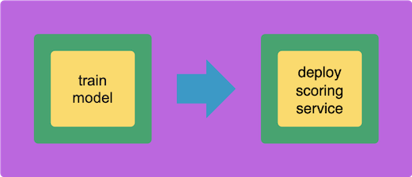

#

## Stages, Steps and Workflows



Each unit of code responsible for executing a specific ML task - e.g. training a model or starting a model-scoring service - is contained within an executable Python module that forms its own stage. Bodywork will run each of these stages in their own containers on Kubernetes.

A step is a collection of stages that can be running at the same time (concurrently) - e.g. training multiple model types in parallel or starting multiple services at once. Stages that can only be executed after another has finished - e.g. serving a model after it has been trained - should be placed in different steps, in the correct order.

A workflow is an ordered collection of steps, that are executed sequentially, where the next step is only executed after all of the stages in the previous step have completed successfully. A workflow can be represented as a [Directed Acyclic Graph (DAG)](https://en.wikipedia.org/wiki/Directed_acyclic_graph).

### Batch and Serving Stages

There are two different types of stage that can be created:

- **batch**: for executing code that performs a discrete task - e.g. training a model. This code will be managed using k8s batch jobs.
- **service**: for executing code that starts a service - e.g. a Flask application that loads a model and then exposes a REST API for model-scoring. This code will be managed using k8s deployments and services.

There is **no** constraint on where within a workflow each type of stage can be created - it is entirely possible to define a workflow that starts with two service deployment stages in the first step and ends with a step that runs a single batch job, if that is what you need to deploy for your project.

### Example: Train-and-Deploy



The majority of ML projects can be described by one model-training stage and one service deployment stage, where the training stage is in the first step and the serving step is in the second. This common scenario is covered in our [MLOps GitHub template project](https://github.com/bodywork-ml/bodywork-ml-ops-project) and is the basis for the Quickstart section.

## Deployment Directly from Git Repos

Bodywork requires ML projects to be stored and distributed as Git repositories - e.g. on GitHub. It will pull the code required for managing workflows and executing stages directly from your project's Git repository. At no point is there any need to build Docker images and push them to a container registry. This simplifies the [CI/CD](https://en.wikipedia.org/wiki/CI/CD) pipeline for your project, so that you can focus on the aspects (e.g. tests) that are more relevant to your machine learning task.

The necessary Python modules and configuration files required for each stage have to be contained within their own directories in your repository. For the common train-and-deploy scenario, the required directory project structure would be similar to:

```text
root/
 |-- stage-1-train-model/
     |-- train_model.py
     |-- requirements.txt
     |-- config.ini
 |-- stage-2-serve-model/
     |-- serve_model.py
     |-- requirements.txt
     |-- config.ini
 |-- bodywork.ini
```

These files will be discussed in more detail in subsequent parts of this documentation, but briefly:

- `*.py` - executable Python modules that run the code required by their stage (e.g. train model).
- `requirements.txt` - 3rd party Python package requirements for each individual stage.
- `config.ini` - stage configuration data, such as the type of stage (batch or serving), secret credentials that need to be retrieved from k8s, etc.
- `bodywork.ini` - workflow configuration data, such as the DAG definition used to assign stages to steps and the order in which the steps will be executed.
