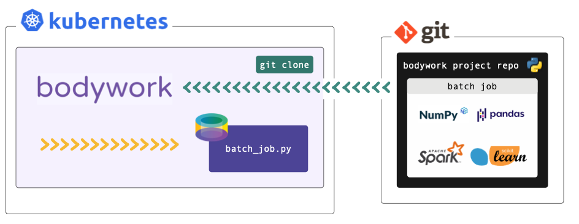

# Deploying a Batch Job

This tutorial refers to files within a Bodywork project hosted on GitHub - see [bodywork-batch-job-project](https://github.com/bodywork-ml/bodywork-batch-job-project). We **strongly** recommend that you find five minutes to read about the [key concepts](key_concepts.md) that Bodywork is built upon, before beginning to work-through the examples below. If you want to execute the examples, you will need to have setup [access to a Kubernetes cluster](index.md#prerequisites) and [installed bodywork](installation.md) on your local machine.



## What am I going to Learn?

* How to take a unit of code defining a ML task (or job) and make it available for execution on Kubernetes, by configuring it as a Bodywork project.
* How to test the Bodywork batch job.
* How to run the batch job on a schedule, without the manual intervention of an ML engineer.

## A Batch Job - Scoring a Dataset with a Pre-Trained Model

The example ML task that we want to run as a batch job with Bodywork, is to load a pre-trained ML model and use it to score a dataset. The latest dataset will be downloaded from cloud storage (AWS S3) and the pre-trained model will be included in the same directory as the files configuring the stage, for convenience (not as best practice).

The Bodywork project for this single-stage workflow is packaged as a [GitHub repository](https://github.com/bodywork-ml/bodywork-batch-job-project), whose root directory is structured as follows,

```text
root/
 |-- score-data/
     |-- score.py
     |-- requirements.txt
     |-- config.ini
     |-- classification_model.joblib
 |-- bodywork.ini
```

## Configuring the Bodywork Batch Stage

The `score-data` directory contains the code and configuration required to run the ML job within a pre-built container on a k8s cluster, as a batch workload. The `score.py` module is a standalone and executable Python module that contains the code required to:

* download the new dataset from cloud storage (AWS S3);
* load the pre-trained model `classification_model.joblib`;
* score the dataset dataset; and,
* save the results back to cloud storage (AWS S3).

It can be summarised as,

```python
from urllib.request import urlopen

# other imports
# ...

DATA_URL = ('http://bodywork-batch-job-project.s3.eu-west-2.amazonaws.com'
            '/data/iris_classification_data.csv')

# other constants
# ...


def main() -> None:
    """Main script to be executed."""
    data = download_dataset(DATA_URL)
    model = load(TRAINED_MODEL_FILENAME)
    scored_data = score_data(data, model)
    upload_results(scored_data)


# other functions definitions used in main()
# ...


if __name__ == '__main__':
    main()
```

We recommend that you spend five minutes familiarising yourself with the full contents of [score.py](https://github.com/bodywork-ml/bodywork-batch-job-project/blob/master/score-data/score.py). When Bodywork runs the stage, it will do so in exactly the same way as if you were to run,

```shell
$ python score.py
```

And so everything defined in `main()` will be executed.

The `requirements.txt` file lists the 3rd party Python packages that will be Pip-installed on the pre-built Bodywork container, as required to run the `score.py` script. In this example we have,

```text
boto3==1.16.15
joblib==0.17.0
pandas==1.1.4
scikit-learn==0.23.2
```

* `boto3` - for interacting with AWS;
* `joblib` - for persisting models;
* `pandas` - for manipulating the raw data; and,
* `scikit-learn` - for training the model.

Finally, the `config.ini` file allows us to configure the key parameters for the stage,

```ini
[default]
STAGE_TYPE="batch"
EXECUTABLE_SCRIPT="score.py"
CPU_REQUEST=0.5
MEMORY_REQUEST_MB=100

[batch]
MAX_COMPLETION_TIME_SECONDS=30
RETRIES=2
```

From which it is clear to see that we have specified that this stage is a batch stage (as opposed to a service-deployment), that `score.py` should be the script that is run, together with an estimate of the CPU and memory resources to request from the k8s cluster, how long to wait and how many times to retry, etc.

## Configuring the Bodywork Batch Workflow

The `bodywork.ini` file in the root of this repository contains the configuration for the whole workflow, which in this case consists of a single stage as defined in the `score-data` directory.

```ini
[default]
PROJECT_NAME="bodywork-batch-job-project"
DOCKER_IMAGE="bodyworkml/bodywork-core:latest"

[workflow]
DAG=score-data

[logging]
LOG_LEVEL="INFO"
```

The most important element is the specification of the workflow DAG, which in this instance is simple and will instruct the Bodywork workflow-controller to run the `score-data` stage.

## Testing the Batch Workflow

Firstly, make sure that the [bodywork](https://pypi.org/project/bodywork/) package has been Pip-installed into a local Python environment that is active. Then, make sure that there is a namespace setup for use by bodywork projects - e.g. `bodywork-batch-jobs` - by running the following at the command line,

```shell
$ bodywork setup-namespace bodywork-batch-jobs
```

Which should result in the following output,

```text
creating namespace=bodywork-batch-job
creating service-account=bodywork-workflow-controller in namespace=bodywork-batch-jobs
creating cluster-role-binding=bodywork-workflow-controller--bodywork-batch-jobs
creating service-account=bodywork-jobs-and-deployments in namespace=bodywork-batch-jobs
```

Then, the workflow can be tested by running the workflow-controller locally (to orchestrate remote containers on k8s), using,

```shell
$ bodywork workflow \
    --namespace=bodywork-batch-jobs \
    https://github.com/bodywork-ml/bodywork-batch-job-project \
    master
```

Which will run the workflow defined in the `master` branch of the project's remote GitHub repository, all within the `bodywork-batch-jobs` namespace. The logs from the workflow-controller and from the container running the stage, will be streamed to the command-line to inform you on the precise state of the workflow, but you can also keep track of the current state of all k8s resources created by the workflow-controller in the `bodywork-batch-jobs` namespace, by using the kubectl CLI tool - e.g.,

```shell
$ kubectl -n bodywork-batch-jobs get all
```

## Running the Batch Workflow on a Schedule

If you're happy with the test results, you can schedule the workflow-controller to operate remotely on the cluster, on a pre-defined schedule. For example, to setup the the workflow to run every hour, use the following command,

```shell
$ bodywork cronjob create \
    --namespace=bodywork-batch-jobs \
    --name=score-data \
    --schedule="0 * * * *" \
    --git-repo-url=https://github.com/bodywork-ml/bodywork-batch-job-project \
    --git-repo-branch=master
```

Each scheduled workflow will attempt to re-run the batch-job, as defined by the state of this repository's `master` branch at the time of execution.

To get the execution history for all `score-data` jobs use,

```shell
$ bodywork cronjob history \
    --namespace=bodywork-batch-jobs \
    --name=score-data
```

Which should return output along the lines of,

```text
JOB_NAME                                START_TIME                    COMPLETION_TIME               ACTIVE      SUCCEEDED       FAILED
score-data-1605214260                   2020-11-12 20:51:04+00:00     2020-11-12 20:52:34+00:00     0           1               0
```

Then to stream the logs from any given cronjob run (e.g. to debug and/or monitor for errors), use,

```shell
$ bodywork cronjob logs \
    --namespace=bodywork-batch-jobs \
    --name=score-data-1605214260
```

## Cleaning Up

To clean-up the deployment in its entirety, delete the namespace using kubectl - e.g. by running,

```shell
$ kubectl delete ns bodywork-batch-jobs
```
