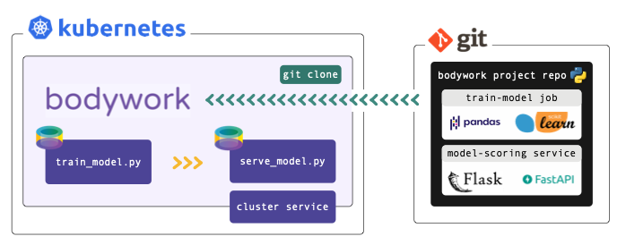

# Deploying a Machine Learning Pipeline



This tutorial builds upon concepts introduced in the [Batch Job](quickstart_batch_job.md) and [Serve Model](quickstart_serve_model.md) quickstart tutorials. It demonstrates how multi-stage ML pipelines can be deployed using Bodywork.

This tutorial refers to files within a Bodywork project hosted on GitHub - check it out [here](https://github.com/bodywork-ml/bodywork-ml-pipeline-project). If you want to execute the examples, you will need to have setup [access to a Kubernetes cluster](index.md#prerequisites) and [installed bodywork](installation.md) on your local machine.

We **strongly** recommend that you find five minutes to read about the [key concepts](key_concepts.md) that Bodywork is built upon, before beginning to work-through the examples below.

!!! info "Working with private repositories"
    If you've cloned the example project into a private repository and intend to use it for this tutorial, then you will need to follow the necessary configuration steps detailed [here](user_guide.md#working-with-private-git-repositories-using-ssh).

## What am I going to Learn?

* How to map a solution to a ML task within a Jupyter notebook, into two Python modules: one for training a model and one for serving the trained model via a REST API endpoint.
* How to execute the `train` and `deploy` modules (a simple ML pipeline), remotely on a [Kubernetes](https://kubernetes.io/) cluster, using [GitHub](https://github.com/) and [Bodywork](https://bodywork.readthedocs.io/en/latest/).
* How to test the REST API service that has been deployed to Kubernetes.
* How to run the pipeline on a schedule, so that the model is periodically re-trained and then re-deployed, without the manual intervention of an ML engineer.

## The ML Task

The ML problem we have chosen to use for this example, is the classification of iris plants into one of their three sub-species, given their physical dimensions. It uses the [iris plants dataset](https://scikit-learn.org/stable/datasets/index.html#iris-dataset) and is an example of a multi-class classification task.

The Jupyter notebook titled [ml_prototype_work.ipynb](https://github.com/bodywork-ml/bodywork-ml-pipeline-project/blob/master/ml_prototype_work.ipynb) and found in the root of the [project's GitHub repository](https://github.com/bodywork-ml/bodywork-ml-pipeline-project), documents the trivial ML workflow used to arrive at a proposed solution to this task. It trains a Decision Tree classifier and persists the trained model to cloud storage. Take five minutes to read through it.

## The MLOps Task

Now that we have developed a solution to our chosen ML task, how do we get it into production - i.e. how can we split the Jupyter notebook into a 'train-model' stage that persists a trained model to cloud storage, and a separate 'deploy-scoring-service' stage that will load the persisted model and start a web service to expose a model-scoring API?

The Bodywork project for this multi-stage workflow is packaged as a [GitHub repository](https://github.com/bodywork-ml/bodywork-ml-pipeline-project), whose root directory is as follows,

```text
root/
 |-- stage-1-train-model/
     |-- train_model.py
     |-- requirements.txt
     |-- config.ini
 |-- stage-2-serve-model/
     |-- serve_model.py
     |-- requirements.txt
     |-- config.ini
 |-- bodywork.ini
```

The remainder of this tutorial is concerned with explaining what is contained within these directories and their files and how to use Bodywork to to deploy the solution to Kubernetes.

## Configuring the Batch Stage

The `stage-1-train-model` directory contains the code and configuration required to train the model within a [pre-built Bodywork container](https://hub.docker.com/repository/docker/bodyworkml/bodywork-core), as a batch workload. Using the `ml_prototype_work.ipynb` notebook as a reference, the `train_model.py` module contains the code required to:

1. download data from an AWS S3 bucket;
2. pre-process the data (e.g. extract labels for supervised learning);
3. train the model and compute performance metrics; and,
4. persist the model to the same AWS S3 bucket that contains the original data.

It can be summarised as,

```python
from datetime import datetime
from urllib.request import urlopen

# other imports
# ...

DATA_URL = ('http://bodywork-ml-pipeline-project.s3.eu-west-2.amazonaws.com'
            '/data/iris_classification_data.csv')

# other constants
# ...


def main() -> None:
    """Main script to be executed."""
    data = download_dataset(DATA_URL)
    features, labels = pre_process_data(data)
    trained_model = train_model(features, labels)
    persist_model(trained_model)


# other functions definitions used in main()
# ...


if __name__ == '__main__':
    main()
```

We recommend that you spend five minutes familiarising yourself with the full contents of [train_model.py](https://github.com/bodywork-ml/bodywork-ml-pipeline-project/blob/master/stage-1-train-model/train_model.py). When Bodywork runs the stage, it will do so in exactly the same way as if you were to run,

```shell
$ python train_model.py
```

And so everything defined in `main()` will be executed.

The `requirements.txt` file lists the 3rd party Python packages that will be Pip-installed on the container, as required to run the `train_model.py` script. In this example we have,

```text
boto3==1.16.15
joblib==0.17.0
pandas==1.1.4
scikit-learn==0.23.2
```

* `boto3` - for interacting with AWS;
* `joblib` - for persisting models;
* `pandas` - for manipulating the raw data; and,
* `scikit-learn` - for training the model.

Finally, the `config.ini` file allows us to configure the key parameters for the stage,

```ini
[default]
STAGE_TYPE="batch"
EXECUTABLE_SCRIPT="train_model.py"
CPU_REQUEST=0.5
MEMORY_REQUEST_MB=100

[batch]
MAX_COMPLETION_TIME_SECONDS=30
RETRIES=2
```

From which it is clear to see that we have specified that this stage is a batch stage (as opposed to a service-deployment), that `train_model.py` should be the script that is run, together with an estimate of the CPU and memory resources to request from the k8s cluster, how long to wait and how many times to retry, etc.

## Configuring the Service Stage

The `stage-2-deploy-scoring-service` directory contains the code and configuration required to load the model trained in `stage-1-train-model` and use it to score single instances (or rows) of data, sent to a REST API endpoint in JSON format. The model's score will be used to return the model's prediction as JSON data in the response.

We have chosen to use the [Flask](https://flask.palletsprojects.com/en/1.1.x/) framework with which to engineer our REST API server. The use of Flask is **not** a requirement and you are free to use different frameworks - e.g. [FastAPI](https://fastapi.tiangolo.com).

Within this stage's directory, `serve_model.py` defines the REST API server application. It can be summarised as,

```python
from urllib.request import urlopen
from typing import Dict

# other imports
# ...

MODEL_URL = ('http://bodywork-ml-pipeline-project.s3.eu-west-2.amazonaws.com/models'
             '/iris_tree_classifier.joblib')

# other constants
# ...

app = Flask(__name__)


@app.route('/iris/v1/score', methods=['POST'])
def score() -> Response:
    """Iris species classification API endpoint"""
    request_data = request.json
    X = make_features_from_request_data(request_data)
    model_output = model_predictions(X)
    response_data = jsonify({**model_output, 'model_info': str(model)})
    return make_response(response_data)


# other functions definitions used in score() and below
# ...


if __name__ == '__main__':
    model = get_model(MODEL_URL)
    print(f'loaded model={model}')
    print(f'starting API server')
    app.run(host='0.0.0.0', port=5000)
```

We recommend that you spend five minutes familiarising yourself with the full contents of [serve_model.py](https://github.com/bodywork-ml/bodywork-ml-pipeline-project/blob/master/stage-2-deploy-scoring-service/serve_model.py). When Bodywork runs the stage, it will start the server defined by `app` and expose the `/iris/v1/score` route that is being handled by `score()`. Note, that this process has no scheduled end and the stage will be kept up-and-running until it is re-deployed or [deleted](user_guide.md#deleting-redundant-service-deployments).

The `requirements.txt` file lists the 3rd party Python packages that will be Pip-installed on the Bodywork container, as required to run `serve_model.py`. In this example we have,

```text
Flask==1.1.2
joblib==0.17.0
numpy==1.19.4
scikit-learn==0.23.2
```

* `Flask` - the framework upon which the REST API server is built;
* `joblib` - for loading the persisted model;
* `numpy` & `scikit-learn` - for working with the ML model.

The `config.ini` file for this stage is,

```ini
[default]
STAGE_TYPE="service"
EXECUTABLE_SCRIPT="serve_model.py"
CPU_REQUEST=0.25
MEMORY_REQUEST_MB=100

[service]
MAX_STARTUP_TIME_SECONDS=30
REPLICAS=2
PORT=5000
```

From which it is clear to see that we have specified that this stage is a service-deployment stage (as opposed to a batch stage), that `serve_model.py` should be the script that is run, together with an estimate of the CPU and memory resources to request from the k8s cluster, how long to wait for the service to start-up and be 'ready', which port to expose and how many instances (or replicas) of the server should be created to stand-behind the cluster-service.

## Configuring the Workflow

The `bodywork.ini` file in the root of this repository contains the configuration for the whole workflow - a workflow being a collection of stages, run in a specific order, that can be represented by a Directed Acyclic Graph (or DAG).

```ini
[default]
PROJECT_NAME="bodywork-ml-pipeline-project"
DOCKER_IMAGE="bodyworkml/bodywork-core:latest"

[workflow]
DAG=stage-1-train-model >> stage-2-deploy-scoring-service

[logging]
LOG_LEVEL="INFO"
```

The most important element is the specification of the workflow DAG, which in this instance is simple and will instruct the Bodywork workflow-controller to train the model and then (if successful) deploy the scoring service.

## Testing the Workflow

Firstly, make sure that the [bodywork](https://pypi.org/project/bodywork/) package has been Pip-installed into a local Python environment that is active. Then, make sure that there is a namespace setup for use by bodywork projects - e.g. `ml-pipeline` - by running the following at the command line,

```shell
$ bodywork setup-namespace ml-pipeline
```

Which should result in the following output,

```text
creating namespace=ml-pipeline
creating service-account=bodywork-workflow-controller in namespace=ml-pipeline
creating cluster-role-binding=bodywork-workflow-controller--ml-pipeline
creating service-account=bodywork-jobs-and-deployments in namespace=ml-pipeline
```

Then, the workflow can be tested by running the workflow-controller locally (to orchestrate remote containers on k8s), using,

```shell
$ bodywork workflow \
    --namespace=ml-pipeline \
    https://github.com/bodywork-ml/bodywork-ml-pipeline-project \
    master
```

Which will run the workflow defined in the `master` branch of the project's remote GitHub repository, all within the `ml-pipeline` namespace. The logs from the workflow-controller and the containers nested within each constituent stage, will be streamed to the command-line to inform you on the precise state of the workflow, but you can also keep track of the current state of all k8s resources created by the workflow-controller in the `ml-pipeline` namespace, by using the kubectl CLI tool - e.g.,

```shell
$ kubectl -n ml-pipeline get all
```

Once the workflow has completed, the scoring service deployed within your cluster will be ready for testing. Service deployments are accessible via HTTP from within the cluster - they are not exposed to the public internet. To test the service from your local machine you will first of all need to start a proxy server to enable access to your cluster. This can be achieved by issuing the following command,

```shell
$ kubectl proxy
```

Then in a new shell, you can use the curl tool to test the service. For example,

```shell
$ curl http://localhost:8001/api/v1/namespaces/ml-pipeline/services/bodywork-ml-pipeline-project--stage-2-deploy-scoring-service/proxy/iris/v1/score \
    --request POST \
    --header "Content-Type: application/json" \
    --data '{"sepal_length": 5.1, "sepal_width": 3.5, "petal_length": 1.4, "petal_width": 0.2}'
```

If successful, you should get the following response,

```json
{
    "species_prediction":"setosa",
    "probabilities":"setosa=1.0|versicolor=0.0|virginica=0.0",
    "model_info": "DecisionTreeClassifier(class_weight='balanced', random_state=42)"
}
```

## Scheduling the Workflow

If you're happy with the test results, then you can schedule the workflow-controller to operate remotely on the cluster as a k8s cronjob. To setup the the workflow to run every hour, for example, use the following command,

```shell
$ bodywork cronjob create \
    --namespace=ml-pipeline \
    --name=ml-pipeline \
    --schedule="* 0 * * *" \
    --git-repo-url=https://github.com/bodywork-ml/bodywork-ml-pipeline-project \
    --git-repo-branch=master \
    --retries=2
```

Each scheduled workflow will attempt to re-run the workflow, end-to-end, as defined by the state of this repository's `master` branch at the time of execution - performing rolling-updates to service-deployments and automatic roll-backs in the event of failure.

To get the execution history for all `ml-pipeline` jobs use,

```shell
$ bodywork cronjob history \
    --namespace=ml-pipeline \
    --name=ml-pipeline
```

Which should return output along the lines of,

```text
JOB_NAME                                START_TIME                    COMPLETION_TIME               ACTIVE      SUCCEEDED       FAILED
ml-pipeline-1605214260          2020-11-12 20:51:04+00:00     2020-11-12 20:52:34+00:00     0           1               0
```

Then to stream the logs from any given cronjob run (e.g. to debug and/or monitor for errors), use,

```shell
$ bodywork cronjob logs \
    --namespace=ml-pipeline \
    --name=ml-pipeline-1605214260
```

## Cleaning Up

To clean-up the deployment in its entirety, delete the namespace using kubectl - e.g. by running,

```shell
$ kubectl delete ns ml-pipeline
```
