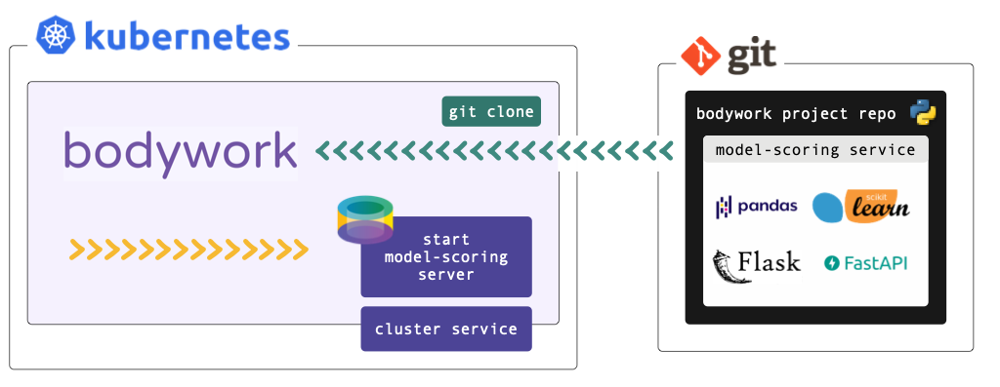

# Deploying a Model-Scoring Service



This tutorial refers to files within a Bodywork project hosted on GitHub - check it out [here](https://github.com/bodywork-ml/bodywork-serve-model-project). If you want to execute the examples, you will need to have setup [access to a Kubernetes cluster](index.md#prerequisites) and [installed bodywork](installation.md) on your local machine.

We **strongly** recommend that you find five minutes to read about the [key concepts](key_concepts.md) that Bodywork is built upon, before beginning to work-through the examples below.

!!! info "Working with private repositories"
    If you've cloned the example project into a private repository and intend to use it for this tutorial, then you will need to follow the necessary configuration steps detailed [here](user_guide.md#working-with-private-git-repositories-using-ssh).

## What am I going to Learn?

* [x] How to deploy a pre-trained model, as a microservice with a REST API, to Kubernetes.
* [x] How to deploy the service.
* [x] How to test the deployed service.

## A REST API for Predicting Class

The example model that we want to serve returns the predicted sub-species of iris plant, given four of its critical dimensions as inputs. For more information on this ML task see ['Quickstart - Deploy ML Pipeline'](quickstart_ml_pipeline.md#the-ml-task).

The Bodywork project for this single-stage workflow is packaged as a [GitHub repository](https://github.com/bodywork-ml/bodywork-serve-model-project), whose root directory is structured as follows,

```text
root/
 |-- scoring-service/
     |-- service.py
     |-- requirements.txt
     |-- config.ini
     |-- classification_model.joblib
 |-- bodywork.ini
```

We have included the pre-trained model as part of the Bodywork project, for convenience (not as best practice).

## Configuring the Stage

The `scoring-service` directory contains the code and configuration required to load a pre-trained model and use it to score a single instance (or row) of data, sent as JSON to a REST API endpoint. We have chosen to use the [Flask](https://flask.palletsprojects.com/en/1.1.x/) framework with which to engineer our REST API server application. The use of Flask is **not** a requirement in any way and you are free to use different frameworks - e.g. [FastAPI](https://fastapi.tiangolo.com).

Within this stage's directory, `service.py` defines the REST API server containing our ML scoring endpoint. It can be summarised as,

```python
from typing import Dict

# other imports
# ...

MODEL_PATH = 'bodywork_project/scoring-service/classification_model.joblib'

# other constants
# ...

app = Flask(__name__)


@app.route('/iris/v1/score', methods=['POST'])
def score() -> Response:
    """Iris species classification API endpoint"""
    request_data = request.json
    X = make_features_from_request_data(request_data)
    model_output = model_predictions(X)
    response_data = jsonify({**model_output, 'model_info': str(model)})
    return make_response(response_data)


# other functions definitions used in score() and below
# ...


if __name__ == '__master__':
    model = load(MODEL_PATH)
    print(f'loaded model={model}')
    print(f'starting API server')
    app.run(host='0.0.0.0', port=5000)
```

We recommend that you spend five minutes familiarising yourself with the full contents of [service.py](https://github.com/bodywork-ml/bodywork-serve-model-project/blob/master/scoring-service/service.py). When Bodywork runs the stage, it will do so in the same way as if you were to run,

```shell
$ python service.py
```

And so it will start the server defined by `app` and expose the `/iris/v1/score` route that is being handled by `score()`. Note, that this process has no scheduled end and the stage will be kept up-and-running until it is re-deployed or [deleted](user_guide.md#deleting-redundant-service-deployments).

The `requirements.txt` file lists the 3rd party Python packages that will be Pip-installed on the Bodywork container, as required to run `service.py`. In this example we have,

```text
Flask==1.1.2
joblib==0.17.0
numpy==1.19.4
scikit-learn==0.23.2
```

* `Flask` - the framework upon which the REST API server is built;
* `joblib` - for loading the persisted model;
* `numpy` & `scikit-learn` - for working with the ML model.

The `config.ini` file for this stage is,

```ini
[default]
STAGE_TYPE="service"
EXECUTABLE_SCRIPT="service.py"
CPU_REQUEST=0.25
MEMORY_REQUEST_MB=100

[service]
MAX_STARTUP_TIME_SECONDS=30
REPLICAS=2
PORT=5000
```

From which it is clear to see that we have specified that this stage is a service (deployment) stage (as opposed to a batch stage), that `service.py` should be the script that is run, together with an estimate of the CPU and memory resources to request from the k8s cluster, how long to wait for the service to start-up and be 'ready', which port to expose and how many instances (or replicas) of the server should be created to stand-behind the cluster-service.

## Configuring the Workflow

The `bodywork.ini` file in the root of this repository contains the configuration for the whole workflow, which in this case consists of a single stage - `scoring-service`.

```ini
[default]
PROJECT_NAME="bodywork-serve-model-project"
DOCKER_IMAGE="bodyworkml/bodywork-core:latest"

[workflow]
DAG=scoring-service

[logging]
LOG_LEVEL="INFO"
```

The most important element is the specification of the workflow DAG, which in this instance is simple and will instruct the Bodywork workflow-controller to run the `scoring-service` stage.

## Testing the Deployment

Firstly, make sure that the [bodywork](https://pypi.org/project/bodywork/) package has been Pip-installed into a local Python environment that is active. Then, make sure that there is a namespace setup for use by Bodywork projects - e.g. `scoring-service` - by running the following at the command line,

```shell
$ bodywork setup-namespace scoring-service
```

Which should result in the following output,

```text
creating namespace=scoring-service
creating service-account=bodywork-workflow-controller in namespace=scoring-service
creating cluster-role-binding=bodywork-workflow-controller--scoring-service
creating service-account=bodywork-jobs-and-deployments in namespace=scoring-service
```

Then, the workflow can be tested by running the workflow-controller locally (to orchestrate remote containers on k8s), using,

```shell
$ bodywork workflow \
    --namespace=scoring-service \
    https://github.com/bodywork-ml/bodywork-serve-model-project \
    master
```

Which will run the workflow defined in the `master` branch of the project's remote GitHub repository, all within the `scoring-service` namespace. The logs from the workflow-controller and the container running the stage, will be streamed to the command-line to inform you on the precise state of the workflow, but you can also keep track of the current state of all k8s resources created by the workflow-controller in the `scoring-service` namespace, by using the kubectl CLI tool - e.g.,

```shell
$ kubectl -n scoring-service get all
```

## Testing the API

Service deployments are accessible via HTTP from within the cluster - they are not exposed to the public internet. To test a service from your local machine you will first of all need to start a proxy server to enable access to your cluster. This can be achieved by issuing the following command,

```shell
$ kubectl proxy
```

Then in a new shell, you can use the curl tool to test the service. For example,

```shell
$ curl http://localhost:8001/api/v1/namespaces/scoring-service/services/bodywork-serve-model-project--scoring-service/proxy/iris/v1/score \
    --request POST \
    --header "Content-Type: application/json" \
    --data '{"sepal_length": 5.1, "sepal_width": 3.5, "petal_length": 1.4, "petal_width": 0.2}'
```

Should return,

```json
{
    "species_prediction":"setosa",
    "probabilities":"setosa=1.0|versicolor=0.0|virginica=0.0",
    "model_info": "DecisionTreeClassifier(class_weight='balanced', random_state=42)"
}
```

According to how the payload has been defined in the `scoring-service/serve.py` module.

## Cleaning Up

To clean-up the deployment in its entirety, delete the namespace using kubectl - e.g. by running,

```shell
$ kubectl delete ns scoring-service
```
