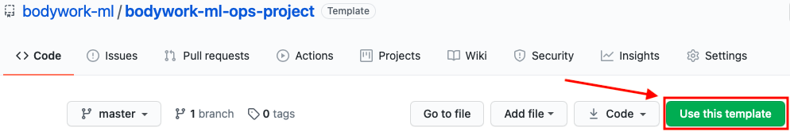

# Deployment Templates

To accelerate the development of your projects, we maintain a set of Bodywork deployment templates for common use-cases:

* [x] [batch scoring data](https://github.com/bodywork-ml/bodywork-batch-job-project)
* [x] [deploying a model-scoring microservice with REST API](https://github.com/bodywork-ml/bodywork-serve-model-project)
* [x] [scheduling a train-and-serve pipeline](https://github.com/bodywork-ml/bodywork-ml-pipeline-project)

## Working with GitHub Template Repositories

Bodywork deployment templates are [GitHub template repositories](https://docs.github.com/en/free-pro-team@latest/github/creating-cloning-and-archiving-repositories/creating-a-repository-from-a-template) that can be automatically cloned into your own GitHub account by clicking the `Use this template` button shown below.

From this point you will be able to deploy the Bodywork template project directly to Kubernetes using the steps in the project's `README`. You can then edit the files in the cloned template project to meet your own project's specific requirements.

!!! info "Working with private repositories"
    If you want to make cloned repositories private, then please make sure to follow the necessary configuration steps as detailed [here](user_guide.md#working-with-private-git-repositories-using-ssh).
